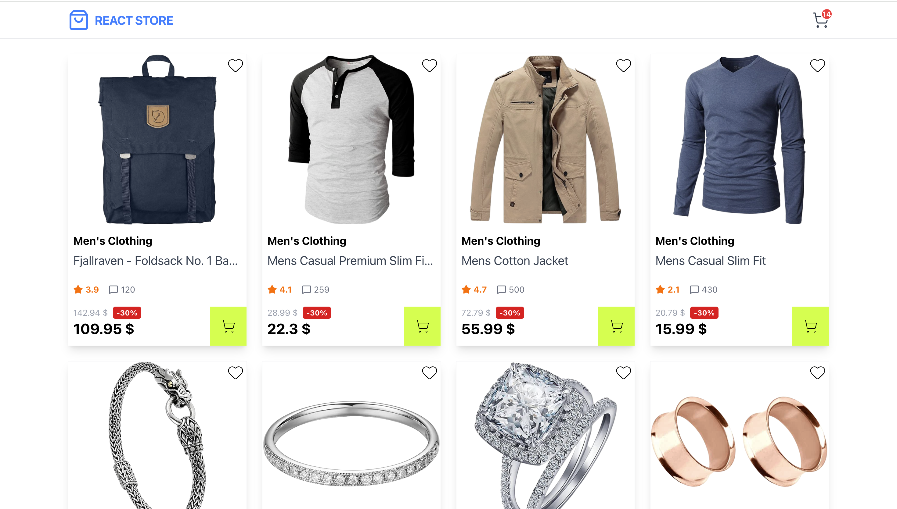
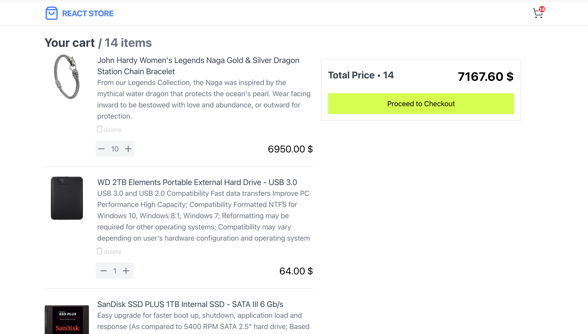
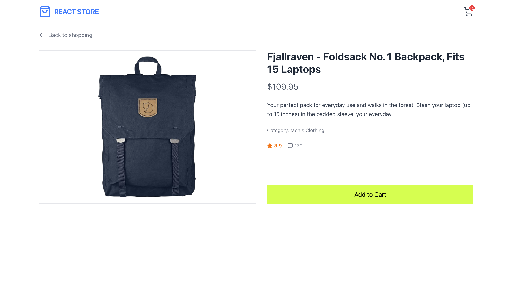

# 🛒 React E-Commerce Store

A modern, fully responsive e-commerce web application built with React, TypeScript, and Redux Toolkit. This project simulates a real-world online store by fetching dynamic product data from the [FakeStore API](https://fakestoreapi.com/).

## 📸 Screenshot





## ✨ Features

- **Dynamic Product Catalog:** Fetches and displays products dynamically from an external REST API.
- **Product Details Page:** Dedicated dynamic routes (`/product/:id`) for viewing specific product details, large images, and ratings.
- **Advanced Shopping Cart:**
  - Add and remove products.
  - Increase or decrease item quantity.
  - Automatic calculation of total items and total price.
- **Data Persistence:** The shopping cart state is saved in `localStorage`, ensuring users don't lose their selected items after a page reload.
- **Toast Notifications:** Beautiful visual feedback (`react-hot-toast`) when adding items to the cart.
- **Responsive Design:** Mobile-first approach using Tailwind CSS (Grid, Flexbox) for a seamless experience on any device.

## 🛠️ Tech Stack

- **Frontend:** React 19, TypeScript, Vite
- **State Management:** Redux Toolkit (`useAppDispatch`, `useAppSelector`)
- **Routing:** React Router v7
- **Styling:** Tailwind CSS v4
- **HTTP Client:** Axios
- **Icons:** Lucide React
- **Notifications:** React Hot Toast

## 🚀 Getting Started

To get a local copy up and running, follow these simple steps.

### Prerequisites

Make sure you have [Node.js](https://nodejs.org/) installed on your machine.

### Installation

1. Clone the repository:
   ```bash
   git clone [https://github.com/yuriiDaniuk/Shoes-store.git](https://github.com/yuriiDaniuk/Shoes-store.git)

2. Navigate to the project directory:
   cd Shoes-store

3. Install the dependencies:
   npm install

4. Start the development server:
   npm run dev